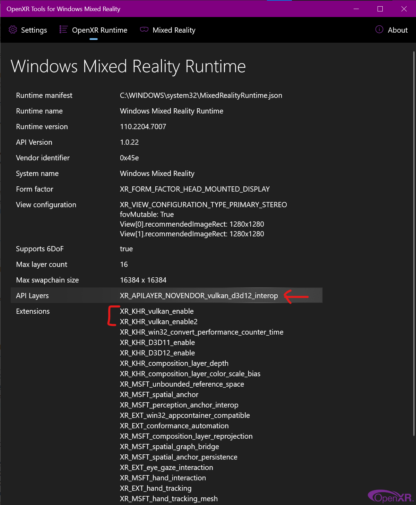

# OpenXR Vulkan to Direct3D 12 interop

This software enables OpenXR apps developed for Vulkan to work with OpenXR runtimes that have support for Direct3D 12 and not Vulkan.

DISCLAIMER: This software is distributed as-is, without any warranties or conditions of any kind. Use at your own risks.

## Limitations

- **THIS IS CURRENTLY DEVELOPER-QUALITY SOFTWARE.**
- This has only been tested with Windows Mixed Reality.
- This has only been tested with NVIDIA.

## Setup

1. Copy the `XR_APILAYER_NOVENDOR_vulkan_d3d12_interop.dll`, `XR_APILAYER_NOVENDOR_vulkan_d3d12_interop.json`, `Install-Layer.ps1` and `Uninstall-Layer.ps1` files to a folder in `%ProgramFiles%`, for example `%ProgramFiles%\OpenXR-Vk-D3D12`.

2. Run `Install-Layer.ps1` (right-click, _Run with PowerShell_). **This must be done from within the folder where the DLL is installed.**

3. (WMR only) In the _OpenXR Tools for Windows Mixed Reality_, inspect the _OpenXR Runtime_ tab:

 

## Removal

1. Run `Uninstall-Layer.ps1` (right-click, _Run with PowerShell_). **This must be done from within the folder where the DLL is installed.**

2. Remove the files.

## Known issues

- Applications using legacy `XR_KHR_vulkan_enable` must enable Vulkan timeline semaphores at device creation time.

```
    VkPhysicalDeviceTimelineSemaphoreFeatures timelineSemaphoreFeatures{
        VK_STRUCTURE_TYPE_PHYSICAL_DEVICE_TIMELINE_SEMAPHORE_FEATURES};
    timelineSemaphoreFeatures.timelineSemaphore = true;

    // Chain timelineSemaphoreFeatures to your VkDeviceCreateInfo struct.
```
